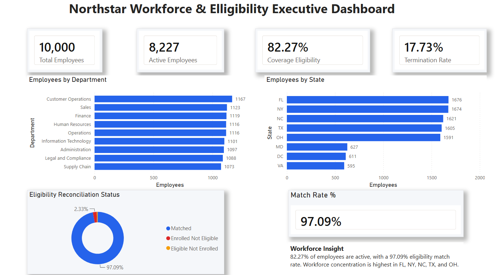

# Azure Cloud DBA & Enterprise Data Platform Portfolio

A production-oriented Azure data platform demonstrating cloud database engineering, data engineering, Infrastructure as Code (IaC), security, observability, and enterprise architecture practices.

This repository is a hands-on portfolio project demonstrating how an Azure workload can be designed, provisioned, documented, and progressively evolved using engineering practices that extend beyond a tutorial or one-off deployment.

The reference implementation uses a fictional organization, **Northstar Benefits Group**, and synthetic data only. No employer-owned, customer, patient, member, or other production data is stored in this repository.

---

## Business Problem

Northstar Benefits Group represents an enterprise benefits organization that processes data from operational databases, employee and eligibility systems, claims and provider systems, enrollment files, partner-delivered files, and other sources.

The organization requires a centralized Azure platform capable of supporting:

- Repeatable infrastructure deployment
- Secure storage of operational and analytical data
- Batch data ingestion and orchestration
- Medallion data transformation
- Cloud database workloads
- Secrets management
- Monitoring and operational visibility
- Governed analytical data products
- Repeatable deployment across environments
- Machine learning and predictive risk scoring
- Future CI/CD and expanded AI capabilities

The solution is designed as an **application landing zone** that would operate within a broader enterprise Azure environment. It focuses on the infrastructure and services normally owned by a data platform engineering team rather than attempting to reproduce an entire organization-wide Azure landing zone in a personal subscription.

---

## Architecture

The target platform follows a layered data architecture:

```text
┌──────────────────────────────────────────────────────────────┐
│                       Source Systems                         │
│                                                              │
│  SQL Server │ Azure SQL │ CSV/JSON │ Partner Files │ APIs   │
└──────────────────────────────┬───────────────────────────────┘
                               │
                               ▼
┌──────────────────────────────────────────────────────────────┐
│                    Ingestion & Orchestration                 │
│                                                              │
│                    Azure Data Factory                        │
└──────────────────────────────┬───────────────────────────────┘
                               │
                               ▼
┌──────────────────────────────────────────────────────────────┐
│                      Data Lake Storage                       │
│                                                              │
│                    Azure Data Lake Gen2                      │
│                                                              │
│       Landing │ Bronze │ Silver │ Gold │ Quarantine         │
└──────────────────────────────┬───────────────────────────────┘
                               │
                               ▼
┌──────────────────────────────────────────────────────────────┐
│                   Processing & Governance                    │
│                                                              │
│        Azure Databricks │ PySpark │ Spark SQL               │
│        Delta Lake / Unity Catalog — planned expansion       │
└──────────────────────────────┬───────────────────────────────┘
                               │
                               ▼
┌──────────────────────────────────────────────────────────────┐
│                  Consumption & Data Products                 │
│                                                              │
│       Azure SQL │ Databricks SQL │ BI / Reporting           │
│       Machine Learning │ Predictive Risk Scoring            │
└──────────────────────────────────────────────────────────────┘
```

Supporting infrastructure includes:

```text
Terraform
   │
   ├── Resource Group
   ├── Networking
   ├── General Storage
   ├── ADLS Gen2
   ├── Azure SQL
   ├── Azure Data Factory
   ├── Azure Databricks
   ├── Azure Key Vault
   └── Log Analytics
```

The architecture is progressively being implemented and hardened as the project evolves.

Detailed architecture documentation is available under [`docs/architecture`](docs/architecture).

---

## Infrastructure as Code

Azure infrastructure is managed using **Terraform**.

The project originally contained Azure resources directly in the root Terraform configuration. The infrastructure is being progressively refactored into reusable child modules while preserving the existing deployed Azure resources.

Terraform `moved` blocks are used during refactoring to change resource addresses without destroying and recreating the underlying Azure resources.

For example, a resource originally managed at a root address such as:

```text
azurerm_virtual_network.portfolio_vnet
```

can be moved to:

```text
module.networking.azurerm_virtual_network.this
```

while Terraform continues managing the same Azure resource.

This allows structural improvements to the codebase to be separated from functional infrastructure changes.

### Current Terraform Modules

```text
terraform/modules/
├── azure-sql/
├── data-factory/
├── data-lake/
├── key-vault/
├── log-analytics/
├── networking/
├── resource-group/
└── storage-account/
```

Each module follows a consistent structure:

```text
module/
├── main.tf
├── variables.tf
├── outputs.tf
└── versions.tf
```

The modules provide defined inputs and outputs, isolate infrastructure responsibilities, and prepare the platform for reusable environment deployments.

---

## Terraform Remote State

Terraform state is stored remotely in Azure Storage rather than relying on a workstation-local state file.

The remote backend provides a centralized source of truth for Terraform-managed infrastructure and allows the same environment to be administered from different workstations or Azure Cloud Shell.

The backend uses a dedicated Terraform state resource group, storage account, container, and state object separate from the workload resources being managed.

Sensitive values are not intended to be committed to source control.

---

## Azure Services

| Service | Responsibility |
|---|---|
| Azure Resource Group | Workload resource boundary |
| Azure Virtual Network | Network foundation |
| Azure Subnet | Workload network segmentation |
| Network Security Group | Network traffic controls |
| Azure Public IP | Public network endpoint for applicable lab resources |
| Azure Network Interface | Network interface for applicable compute workloads |
| Azure Storage | General-purpose object storage |
| Azure Data Lake Storage Gen2 | Medallion data lake |
| Azure Data Factory | Data ingestion and orchestration |
| Azure Databricks | Distributed data processing |
| Azure SQL Database | Relational database workload |
| Azure Key Vault | Secrets-management foundation |
| Azure Log Analytics | Centralized monitoring foundation |

---

## Medallion Architecture

The data-engineering design progressively refines data through logical processing layers.

### Landing

Immutable source deliveries and ingestion artifacts.

### Bronze

Raw or source-aligned records retained for traceability and replay.

### Silver

Validated, standardized, cleaned, deduplicated, and conformed data.

### Gold

Business-ready datasets, aggregations, and analytical models.

### Quarantine

Invalid or nonconforming records requiring investigation or remediation.

Bronze, Silver, and Gold storage are currently represented in the Azure Data Lake implementation. Landing and Quarantine are part of the target architecture and planned expansion.

---

## Data Engineering Examples

The repository contains synthetic datasets for demonstrating data-engineering patterns:

```text
data/
├── employees.csv
└── sales.csv
```

Current notebooks include:

```text
notebooks/
├── 01_ADLS_Bronze_Silver_Gold_Pipeline.py
├── 02_Retail_Sales_Bronze_Silver_Gold.py
└── 03_SQL_Analytics_Gold_Data.sql
```

These workloads demonstrate concepts including:

- Bronze-to-Silver-to-Gold processing
- PySpark transformations
- Data cleaning and standardization
- Analytical aggregation
- Spark SQL
- Analytics-ready Gold data

The retail workload provides one practical example of a business workload running on the broader platform rather than defining the entire purpose of the repository.

---
## Machine Learning & Predictive Risk Scoring

The Northstar workload extends the enterprise data platform beyond descriptive analytics by introducing a machine-learning layer for eligibility reconciliation risk prioritization.

The objective is to determine whether information available before reconciliation can help operations teams prioritize enrollment records that are more likely to produce downstream eligibility exceptions.

### End-to-End Flow

```text
Northstar Source Data
        │
        ▼
ADLS Bronze
Raw enrollment, employee, dependent,
and eligibility data
        │
        ▼
Databricks Silver
Validated, standardized, deduplicated,
and conformed records
        │
        ▼
Gold Reconciliation
Business-ready eligibility reconciliation
and analytical datasets
        │
        ▼
ML Feature Engineering
Leakage-safe pre-reconciliation features
        │
        ▼
Model Training & Evaluation
Logistic Regression + Random Forest
        │
        ▼
Persisted Model
Reusable scikit-learn pipeline
        │
        ▼
Operational Scoring
Relative exception-risk ranking
        │
        ▼
Prioritized Review Queue
HIGH / MEDIUM / LOW
        │
        ▼
Power BI / Operations

```

### ML Pipeline

The implementation is separated into three stages:

- [`01_build_training_dataset.py`](ml/northstar/01_build_training_dataset.py) — constructs the enrollment-level training dataset and engineers leakage-safe features.
- [`02_train_exception_model.py`](ml/northstar/02_train_exception_model.py) — trains and compares classifiers, evaluates model performance, measures prioritization lift, and persists the selected model.
- [`03_score_enrollments.py`](ml/northstar/03_score_enrollments.py) — independently loads the trained model and produces a ranked operational review queue.

Detailed implementation notes are available in the [`Northstar ML README`](ml/northstar/README.md).

### Model Evaluation

The training dataset contains 36,397 enrollment records with a 4.77% exception rate.

Two classifiers were evaluated using the same leakage-safe train/test split:

| Model | ROC-AUC | Exception Recall | Exception Precision | Exception F1 |
|---|---:|---:|---:|---:|
| Logistic Regression | 0.5376 | 45.82% | 5.33% | 9.54% |
| Random Forest | 0.5191 | 29.68% | 5.55% | 9.35% |

Logistic Regression was retained for the scoring proof-of-concept because it provided stronger recall, F1, and ROC-AUC for the exception class.

### Operational Prioritization

Model output is treated as a **relative risk ranking**, not as a calibrated probability of failure.

The operational queue assigns:

- **HIGH** — top 10% of scored records
- **MEDIUM** — next 20%
- **LOW** — remaining 70%

On the held-out test set, the HIGH tier captured **14.12% of known exceptions while representing only 10% of records**, producing a **1.41x lift over the baseline exception rate**.

The HIGH + MEDIUM population captured **35.45% of exceptions within 30% of records**, producing a **1.18x lift**.

### Engineering Interpretation

The experiment demonstrates modest prioritization value but limited overall predictive strength from the currently available pre-reconciliation features.

The ML component is therefore presented as a **proof-of-concept**, not a production-ready prediction system.

A production implementation would require richer historical and operational signals such as prior reconciliation history, employer submission behavior, plan-change history, processing latency, file-quality metrics, and historical exception frequency.

---

## Architecture Decision Records

Important platform decisions are documented explicitly through Architecture Decision Records (ADRs):

```text
docs/adr/
├── ADR-0001-platform-scope.md
├── ADR-0002-terraform-standard.md
└── ADR-0003-environment-strategy.md
```

Current ADRs document decisions concerning:

- Platform scope and workload boundaries
- Terraform as the Infrastructure as Code standard
- Environment strategy

This provides a record of not only **what** was implemented, but **why** architectural decisions were made.

---

## Architecture Documentation

Detailed platform documentation is maintained alongside the implementation:

```text
docs/architecture/
├── environment-strategy.md
├── logical-architecture.md
├── naming-standards.md
└── platform-overview.md
```

Architecture diagram source files are maintained under:

```text
docs/diagrams/
├── enterprise-data-platform.drawio
└── enterprise-data-platform-enhanced.drawio
```

The documentation describes platform scope, logical architecture, naming conventions, environment strategy, security direction, data architecture, and target-state capabilities.

---

## Repository Structure

```text
azure-cloud-dba-portfolio/
├── data/
│   ├── employees.csv
│   └── sales.csv
│
├── docs/
│   ├── adr/
│   ├── architecture/
│   └── diagrams/
│
├── notebooks/
│   ├── 01_ADLS_Bronze_Silver_Gold_Pipeline.py
│   ├── 02_Retail_Sales_Bronze_Silver_Gold.py
│   └── 03_SQL_Analytics_Gold_Data.sql
|
├── ml/
│   └── northstar/
│       ├── README.md
│       ├── 01_build_training_dataset.py
│       ├── 02_train_exception_model.py
│       └── 03_score_enrollments.py
│
├── screenshots/
├── scripts/
│
├── terraform/
│   └── modules/
│       ├── azure-sql/
│       ├── data-factory/
│       ├── data-lake/
│       ├── key-vault/
│       ├── log-analytics/
│       ├── networking/
│       ├── resource-group/
│       └── storage-account/
│
├── .gitignore
├── LICENSE
└── README.md
```

---

## Engineering Principles

The platform is being developed around several core engineering principles:

- Infrastructure as Code instead of portal-driven deployment
- Version-controlled infrastructure and data-engineering code
- Modular and reusable Terraform
- Remote infrastructure state
- Separation of infrastructure responsibilities
- State-safe infrastructure refactoring
- Separation of structural refactoring from functional changes
- Secure handling of credentials and secrets
- Least-privilege access as a target security model
- Repeatable environment deployment
- Medallion data architecture
- Architecture decisions documented alongside code
- Monitoring and operational support as platform concerns
- Synthetic data for portfolio workloads

---

## Current Implementation Status

### Implemented

- Azure workload resource group
- Azure networking foundation
- Virtual network and subnet
- Network Security Group and subnet association
- Public IP and network interface
- General-purpose Azure Storage
- Azure Data Lake Storage Gen2
- Bronze, Silver, and Gold storage layers
- Azure SQL logical server
- Azure SQL Database
- Azure SQL firewall configuration
- Azure Data Factory
- Azure Databricks workspace
- Azure Key Vault
- Azure Log Analytics workspace
- Terraform remote state in Azure Storage
- Modular Terraform for major platform components
- State-preserving Terraform refactoring using `moved` blocks
- Common resource tagging structure
- PySpark Medallion transformation examples
- Spark SQL analytics example
- Architecture documentation
- Architecture Decision Records
- Naming and tagging standards
- GitHub Actions continuous integration
- Automated Python syntax validation for Northstar ML workloads
- Automated Terraform formatting validation
- Automated Terraform initialization without remote backend access
- Automated Terraform configuration validation

### In Progress

- Remaining Terraform modularization and refinement
- Azure Databricks Terraform module
- Data Factory pipeline implementation
- Databricks processing expansion
- Data-quality controls
- Security hardening
- Monitoring and diagnostic integration
- Environment separation

### Planned

- Landing and Quarantine layers
- Delta Lake expansion
- Unity Catalog governance
- Metadata-driven ingestion
- Full and incremental loading patterns
- Retry and failure handling
- Audit logging and row-count reconciliation
- Managed identities
- Expanded Azure RBAC
- Private connectivity where appropriate
- Azure resource diagnostic settings
- Data-quality and freshness monitoring
- Terraform security scanning in CI
- Python linting and automated testing
- OpenID Connect authentication for Azure deployments
- Environment approvals and controlled promotion
- Operational alerts and runbooks
- BI consumption layer
- Expanded machine learning and Azure AI workloads

---

## CI/CD

Continuous integration is implemented with GitHub Actions through `.github/workflows/ci.yml`.

The workflow runs automatically on pushes and pull requests targeting `main`.

Current CI validation includes:

- Python 3.12 environment setup
- Dependency installation for Northstar ML workloads
- Python syntax compilation checks for the Northstar ML scripts
- Terraform formatting validation with `terraform fmt -check -recursive`
- Terraform initialization with the remote backend disabled
- Terraform configuration validation with `terraform validate`

The current workflow provides CI validation only. Automated Azure deployment is intentionally not enabled.

The next phase will introduce controlled continuous delivery using Azure OpenID Connect authentication, Terraform plan/apply separation, and environment approval controls.

## Terraform Workflow

A typical Terraform workflow for the project is:

```bash
terraform -chdir=terraform fmt -recursive
terraform -chdir=terraform init
terraform -chdir=terraform validate
terraform -chdir=terraform plan
terraform -chdir=terraform apply
```

Before applying infrastructure changes, Terraform plans are reviewed to understand whether resources will be created, modified, destroyed, or simply moved to new Terraform addresses.

During module refactoring, a successful migration should ideally produce:

```text
Plan: 0 to add, 0 to change, 0 to destroy.
```

This confirms that Terraform's configuration structure changed without modifying the underlying Azure infrastructure.

---

## Git Workflow

Infrastructure and documentation changes are version controlled in Git.

A typical workflow includes:

```bash
git status
git add <files>
git commit -m "descriptive commit message"
git pull --rebase origin main
git push origin main
```

The repository history intentionally records the platform's evolution, including architecture documentation, Terraform modularization, state-safe refactoring, and infrastructure improvements.

---

## Project Evolution

This repository began as a practical Azure data-engineering workload demonstrating a retail sales Medallion pipeline.

It has since evolved into a broader **Azure cloud database and enterprise data platform engineering portfolio**.

The project now demonstrates not only how individual Azure services are deployed, but how an existing cloud environment can be progressively improved through:

- Infrastructure as Code
- Terraform modularization
- Remote state management
- State-safe refactoring
- Cloud database engineering
- Data engineering
- Architecture documentation
- Security design
- Environment strategy
- Operational thinking
- Version control

The evolution is intentionally visible in the Git history and documentation.

---

## Power BI Executive Analytics

The **Northstar Workforce & Eligibility Executive Dashboard** provides an executive-level view of workforce distribution, employee activity, and eligibility reconciliation across the synthetic Northstar Benefits Group dataset.

The dashboard highlights:

- 10,000 total employees and 8,227 active employees
- 82.27% workforce coverage eligibility
- 17.73% termination rate
- Employee distribution by department and state
- Eligibility reconciliation with a 97.09% match rate
- Executive-level workforce insights for operational decision-making



The Power BI report demonstrates the analytical consumption layer of the platform, transforming curated enterprise data into business-facing KPIs and visual insights.

---

## Roadmap

The next phases of the project will focus on:

1. Complete Terraform modularization, including Azure Databricks.
2. Expand Azure Data Factory orchestration.
3. Build more complete ingestion workflows.
4. Expand Databricks and PySpark processing.
5. Introduce Delta Lake capabilities.
6. Add data-quality and quarantine patterns.
7. Strengthen identity, RBAC, secrets, and network security.
8. Integrate diagnostics, Log Analytics, and operational alerting.
9. Introduce CI/CD with GitHub Actions.
10. Add analytical consumption and future AI-oriented workloads.

---

## Disclaimer

This repository is an independent portfolio and learning project.

**Northstar Benefits Group is fictional.** All organizations, business scenarios, datasets, credentials, and workloads represented in this project are fictional or synthetic.

The repository does not contain proprietary employer information, customer information, production credentials, personally identifiable production data, or production workloads.